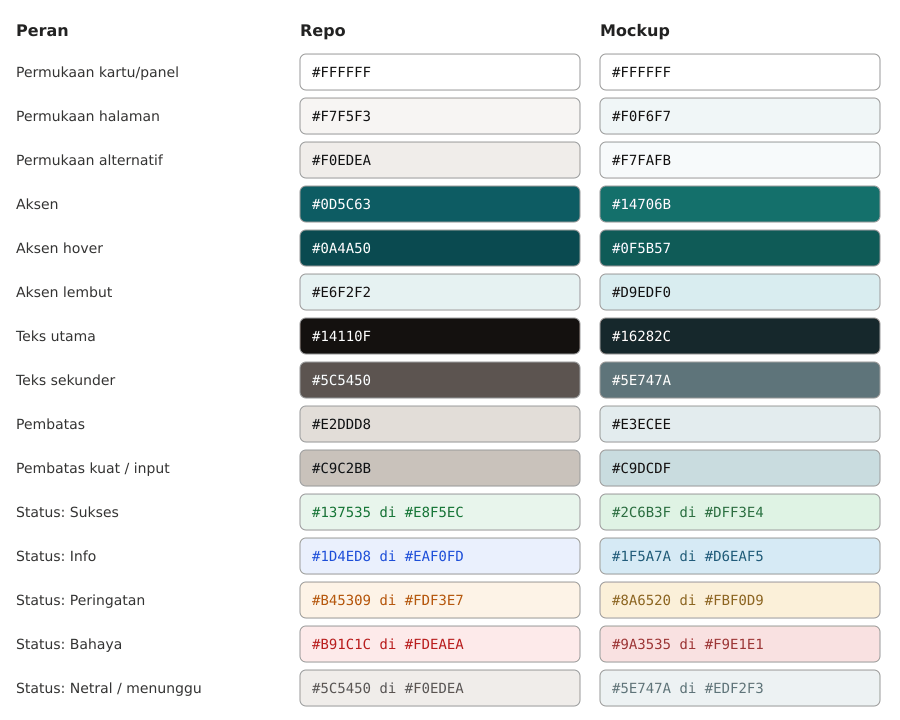

# Palet repo dan palet mockup — keputusan dan koreksi AA

⛔ **DIPUTUSKAN, 26 September 2026** (keputusan kampanye Hidupkan desain —
`docs/RENCANA-HIDUPKAN-DESAIN.md`). Dokumen ini semula "bahan keputusan, tanpa
rekomendasi" — angka disajikan sebelum ada keputusan, dan token repo tidak
berubah sampai user memutuskan. Keputusannya sekarang ada: **repo memakai
nilai mockup** (kolom "Mockup" di setiap tabel di bawah) untuk seluruh peran
warna, kecuali **satu pengecualian eksplisit** — status netral/menunggu
dinaikkan minimal dari kontras 4,37 ke 4,5 supaya lolos AA (bukan AA besar).
Angka di tabel tetap dari pengukuran asli 15 September 2026 dan tidak
disunting; yang berubah adalah kolom mana yang sekarang berlaku sebagai
nilai EFEKTIF repo — lihat catatan di setiap tabel dan § Empat koreksi AA di
bawah.

Dibangkitkan `alat/palet.mjs` dari `ds-bundle/tokens/colors.css` (repo, NILAI DEKLARASI BUNDLE — vendor, bukan lagi nilai efektif sejak keputusan ini) dan `sumber/tokens/colors.css` (mockup, blok `:root` terang, kini NILAI EFEKTIF repo). Kontras dihitung dengan rumus luminans relatif WCAG 2.x. Ambang: **AA** ≥ 4,5 (teks biasa), **AA besar** ≥ 3 (teks ≥ 18,66 px tebal atau ≥ 24 px, juga batas non-teks), **AAA** ≥ 7.

## Peran warna

| Peran | Repo (deklarasi bundle — superseded) | Mockup (kini nilai EFEKTIF repo) |
|---|---|---|
| Permukaan kartu/panel | `#FFFFFF` `--surface` | `#FFFFFF` `--card` |
| Permukaan halaman | `#F7F5F3` `--surface-sunk` | `#F0F6F7` `--background` |
| Permukaan alternatif | `#F0EDEA` `--surface-alt` | `#F7FAFB` `--muted` |
| Aksen | `#0D5C63` `--accent` | `#14706B` `--primary` |
| Aksen hover | `#0A4A50` `--accent-hover` | `#0F5B57` `--accent-hover` |
| Aksen lembut | `#E6F2F2` `--accent-soft` | `#D9EDF0` `--accent-subtle` |
| Teks utama | `#14110F` `--ink` | `#16282C` `--foreground` |
| Teks sekunder | `#5C5450` `--ink-muted` | `#5E747A` `--muted-foreground` |
| Pembatas | `#E2DDD8` `--border` | `#E3ECEE` `--border` |
| Pembatas kuat / input | `#C9C2BB` `--border-strong` | `#C9DCDF` `--input-border` |

## Kontras teks terhadap permukaannya

| Pasangan | Repo (deklarasi bundle — superseded) | Mockup (kini nilai EFEKTIF repo) |
|---|---|---|
| Teks utama di kartu | 18.80:1 AAA | 15.28:1 AAA |
| Teks utama di halaman | 17.29:1 AAA | 14.00:1 AAA |
| Teks utama di permukaan alternatif | 16.12:1 AAA | 14.57:1 AAA |
| Teks sekunder di kartu | 7.40:1 AAA | 4.94:1 AA |
| Teks sekunder di halaman | 6.80:1 AA | 4.52:1 AA |
| Teks sekunder di permukaan alternatif | 6.34:1 AA | 4.71:1 AA |
| Aksen sebagai teks di kartu | 7.70:1 AAA | 5.90:1 AA |
| Aksen sebagai teks di halaman | 7.08:1 AAA | 5.40:1 AA |
| Aksen sebagai teks di aksen lembut | 6.73:1 AA | 4.87:1 AA |
| Teks putih di tombol aksen | 7.70:1 AAA | 5.90:1 AA |

## Pembatas (non-teks)

WCAG 1.4.11 menuntut 3:1 untuk batas yang **dibutuhkan** agar kontrol dapat dikenali, misalnya tepi field input. Tepi dekoratif kartu tidak terkena aturan itu.

| Pasangan | Repo (deklarasi bundle — superseded) | Mockup (kini nilai EFEKTIF repo) |
|---|---|---|
| Pembatas di kartu | 1.35:1 | 1.20:1 |
| Pembatas di halaman | 1.24:1 | 1.10:1 |
| Pembatas kuat / input di kartu | 1.76:1 | 1.42:1 |

## Lima warna status — teks di atas latar lembutnya sendiri

| Status | Repo — deklarasi bundle, superseded (teks · latar) | Kontras repo (lama) | Mockup — kini nilai EFEKTIF (teks · latar) | Kontras mockup |
|---|---|---|---|---|
| Sukses | `#137535` `--success` · `#E8F5EC` `--success-soft` | 5.16:1 AA | `#2C6B3F` `--status-success-text` · `#DFF3E4` `--status-success-bg` | 5.51:1 AA |
| Info | `#1D4ED8` `--info` · `#EAF0FD` `--info-soft` | 5.87:1 AA | `#1F5A7A` `--status-info-text` · `#D6EAF5` `--status-info-bg` | 6.05:1 AA |
| Peringatan | `#B45309` `--warning` · `#FDF3E7` `--warning-soft` | 4.58:1 AA | `#8A6520` `--status-warning-text` · `#FBF0D9` `--status-warning-bg` | 4.69:1 AA |
| Bahaya | `#B91C1C` `--danger` · `#FDEAEA` `--danger-soft` | 5.59:1 AA | `#9A3535` `--status-danger-text` · `#F9E1E1` `--status-danger-bg` | 5.75:1 AA |
| Netral / menunggu | `#5C5450` `--ink-muted` · `#F0EDEA` `--surface-alt` | 6.34:1 AA | `#5E747A` `--status-pending-text` · `#EDF2F3` `--status-pending-bg` | 4.37:1 AA besar |

⛔ Repo tidak punya token status "menunggu". Baris terakhir memasangkan `pending` mockup dengan `.badge-neutral` repo (`ds-bundle/components.css:66`). Itu padanan fungsi, bukan token bernama sama.

## Empat koreksi AA — satu-satunya penyimpangan dari nilai mockup

Keputusan kampanye: nilai mockup dipakai apa adanya, **kecuali** empat token
berikut, yang dinaikkan sedikit lebih gelap semata untuk lolos ambang AA (≥
4,5:1). Ini bukan preferensi selera — baris "Netral / menunggu" di atas
menunjukkan alasannya: 4,37:1 lolos AA BESAR tapi gagal AA teks biasa, dan
`.badge-neutral` merender teks pada ukuran biasa, bukan besar.

| Token | Nilai mockup | Nilai repo (dikoreksi) | Kontras mockup → repo |
|---|---|---|---|
| `--status-pending-text` | `#5e747a` | `#5c7177` | 4,37:1 → 4,55:1 (vs `--status-pending-bg`) |
| `--sidebar-label` | `#789194` | `#5e7477` | 3,06:1 → 4,53:1 (vs `--background`) |
| `--step-inactive-text` | `#7b9597` | `#596f71` | 2,71:1 → 4,53:1 (vs `--step-inactive-bg`) |
| `--icon-muted` | `#9ab4b5` | `#789b9c` | 2,19:1 → 3,01:1 (vs `--card`, ambang ikon 3,0) |

Keempatnya dipaku di `packages/ds/tokens-mockup.css` dengan komentar di
tempatnya, dan dijaga `tests/runtime/token-mockup.test.js` — token itu WAJIB
sama persis dengan `sumber/tokens/colors.css`, kecuali keempat baris ini.
Tidak ada nilai warna lain yang menyimpang dari mockup.

## Yang ikut berubah karena palet mockup dipilih, dan bukan warna

Dicatat supaya keputusan palet tidak diam-diam memutuskan hal lain juga —
seluruhnya keputusan kampanye Hidupkan desain, 26 September 2026
(`docs/RENCANA-HIDUPKAN-DESAIN.md`):

- **Font.** Mockup memakai Nunito Sans 400/600/700/800. Repo kini memakai
  Nunito Sans juga, self-host — bukan lagi Inter 400/500/600 yang dipilih
  sebelumnya karena tabular numerals (`docs/DESIGN.md` § 2). Alasan tabular
  numerals tidak hilang: `.num` tidak bergantung pada keluarga font.
- **Ukuran teks kecil.** Mockup 13 px, dan repo kini memakainya
  (`--text-small`, diarahkan dari `--text-caption` bundle) — bukan lagi 12 px.
  Skala LIMA token repo (keputusan user 31 Agustus 2026, "Opsi A") digantikan
  skala EMPAT token (`CLAUDE.md` § Skala teks final).
- **Aksen.** `#0D5C63` disebut `CLAUDE.md` sebagai hal yang sebelumnya "tidak
  boleh disentuh sama sekali". Aturan itu DICABUT oleh keputusan kampanye ini
  — repo kini memakai aksen mockup (`--primary`, `#14706b`).
- **Mode gelap.** `sumber/readme.md` menyebut 14 token yang berbeda di mode
  gelap, dan `sumber/guidelines/colors-dark-mode.html` memperagakannya.
  `sumber/tokens/colors.css` di ekspor ini hanya memuat blok `:root` terang.
  Aturan DS #8 repo tetap: tanpa dark mode — TIDAK dicabut oleh keputusan ini.
  Tabel di atas hanya membandingkan mode terang.
