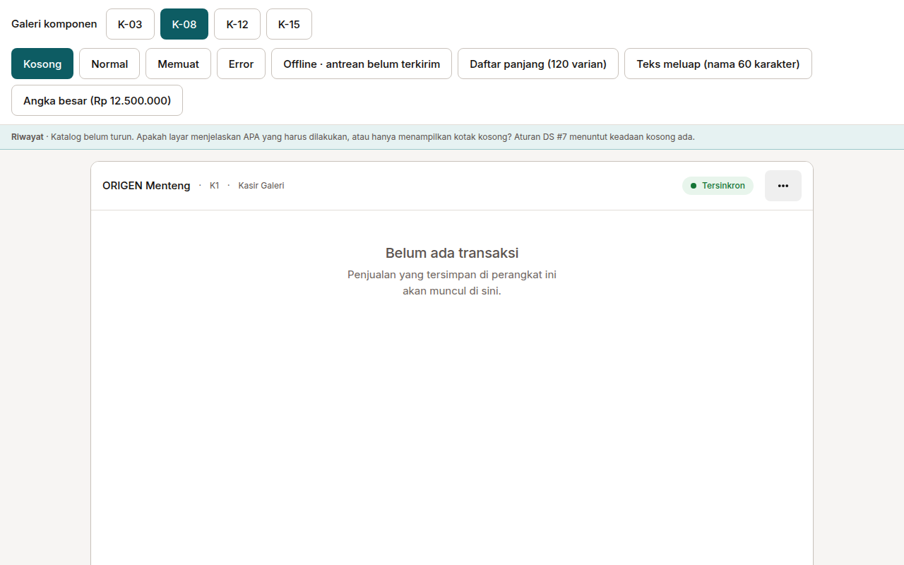
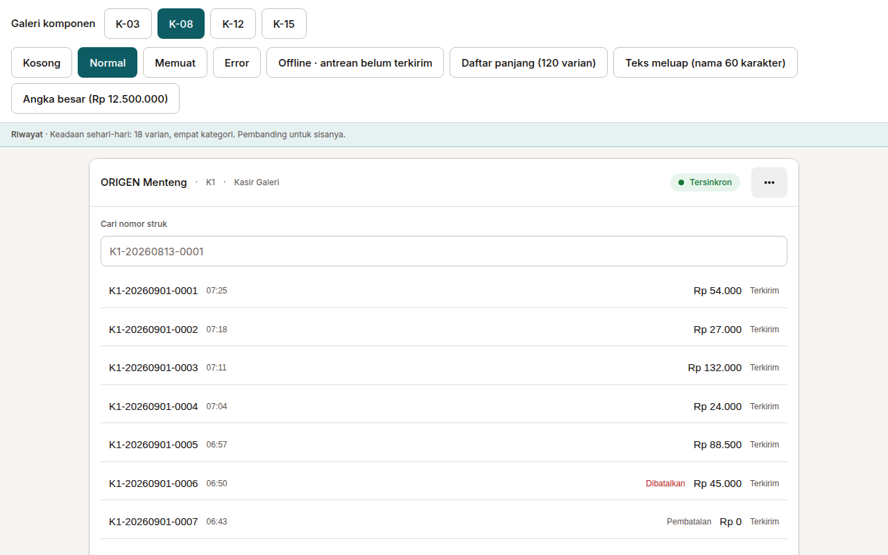
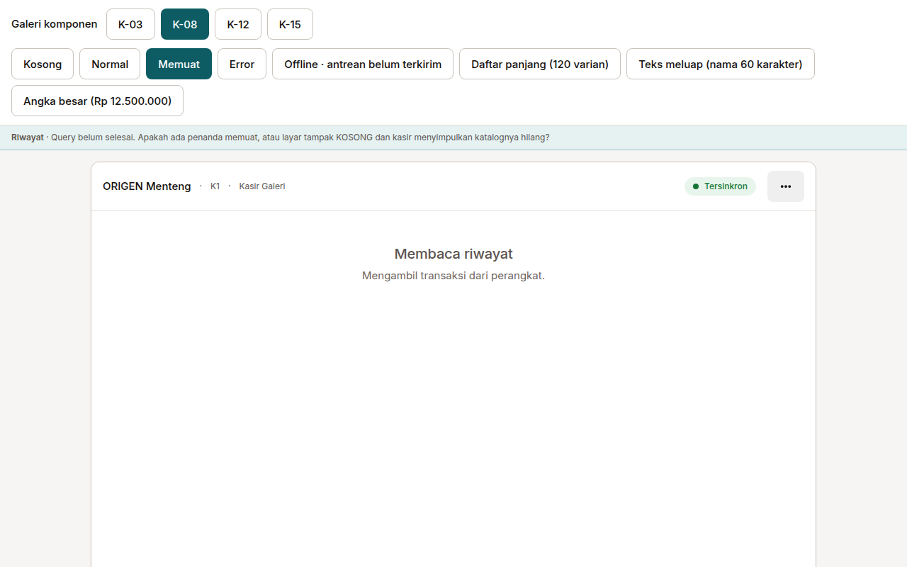
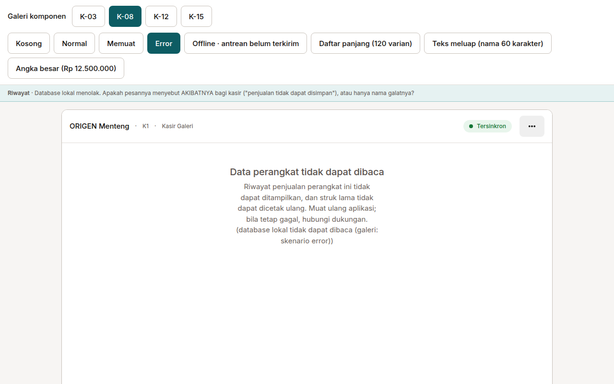
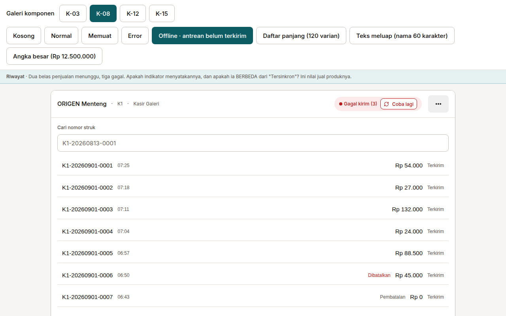
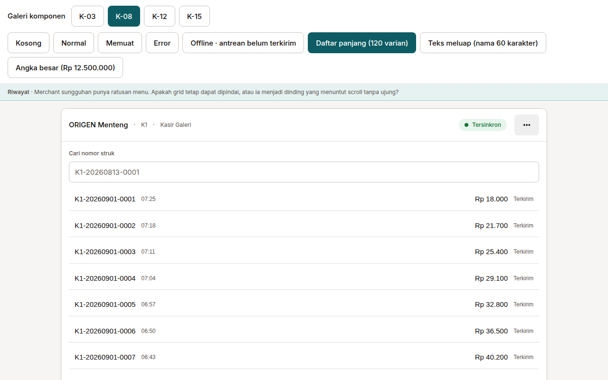
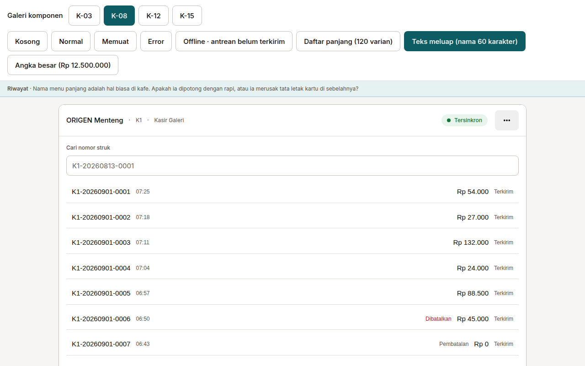
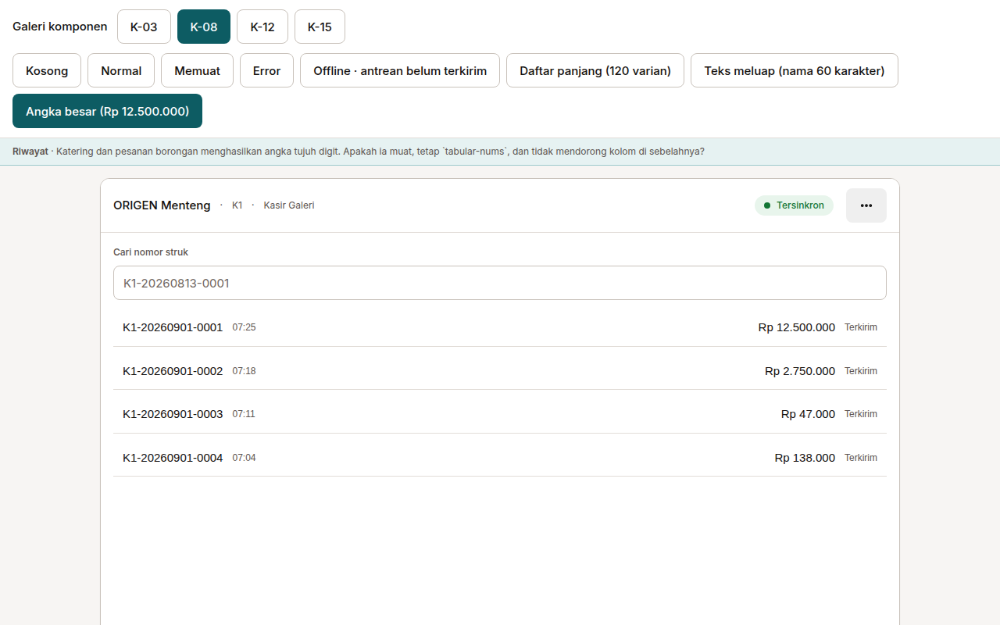

# K-08 — Riwayat transaksi

Ditangkap dari galeri komponen (`npm run build:galeri`, build STATIS — bukan dev server). Dua viewport per keadaan: `tablet-1280x800` (tablet kasir, `PRD:428`) dan `backoffice-1440x900`.

Buka sel mana pun langsung: `?layar=K-08&keadaan=<keadaan>`

| Keadaan | Apa yang harus terlihat | Tablet 1280×800 |
|---|---|---|
| `kosong` | Katalog/daftar belum ada. Harus ada kalimat yang menyebut APA yang perlu dilakukan, bukan kotak kosong. |  |
| `normal` | Keadaan sehari-hari. Pembanding untuk sisanya. |  |
| `memuat` | Query belum selesai. Harus ada penanda memuat — bukan layar yang tampak kosong. |  |
| `error` | Database lokal menolak. Pesan harus menyebut AKIBATNYA bagi kasir, bukan nama galatnya. |  |
| `offline` | 12 menunggu + 3 gagal di antrean. Indikator harus BERBEDA dari "Tersinkron". |  |
| `panjang` | 120 varian. Grid harus tetap dapat dipindai — saringan kategori terlihat. |  |
| `meluap` | Nama 60 karakter. Harus terpotong rapi TANPA menarik tinggi kartu tetangganya. |  |
| `angka-besar` | Rp 12.500.000. Harus muat, tetap tabular-nums, tidak mendorong kolom sebelahnya. |  |

Berkas `backoffice-1440x900-*.png` ada di direktori yang sama.
